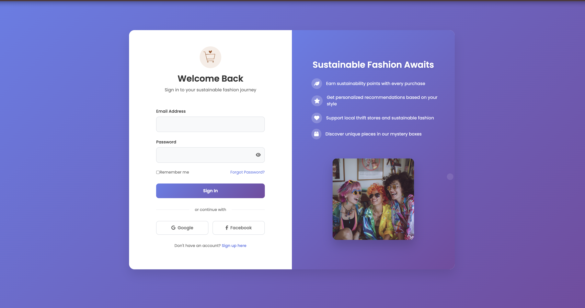
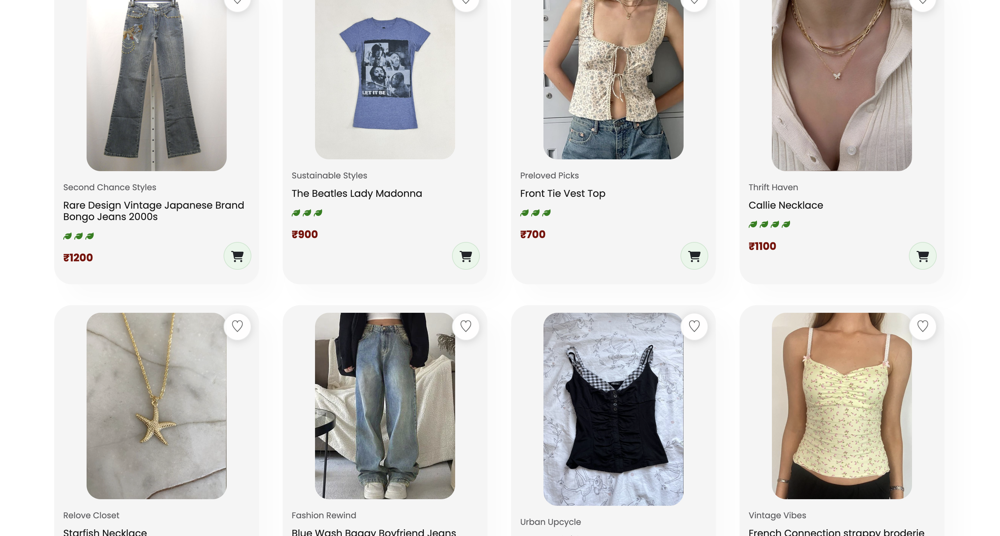
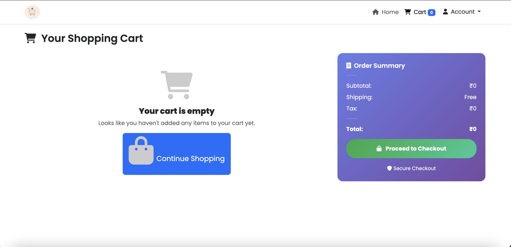

# Aestheticize 🌿

A sustainable fashion e-commerce platform connecting Gen Z with thrift stores and eco-friendly fashion choices.

## Features ✨

- 🔐 **User Authentication** - Secure login and registration
- 🛍️ **Shopping Cart** - Add and manage items with persistent storage
- 👤 **User Profiles** - Personalized accounts with order history
- 💝 **Mystery Boxes** - Aesthetic-themed surprise packages
- 🌟 **Influencer Program** - Collaborate with fashion creators

## How to Access 🚀

1. **Start Backend Server**
   ```bash
   cd backend
   npm install
   npm start
   ```

2. **Start Frontend Server**
   ```bash
   python3 -m http.server 3000
   ```

3. **Visit**: http://localhost:3000

## Page Previews 📱

### Login Page



### Home Page  


### Product Catalog



### Shopping Cart


